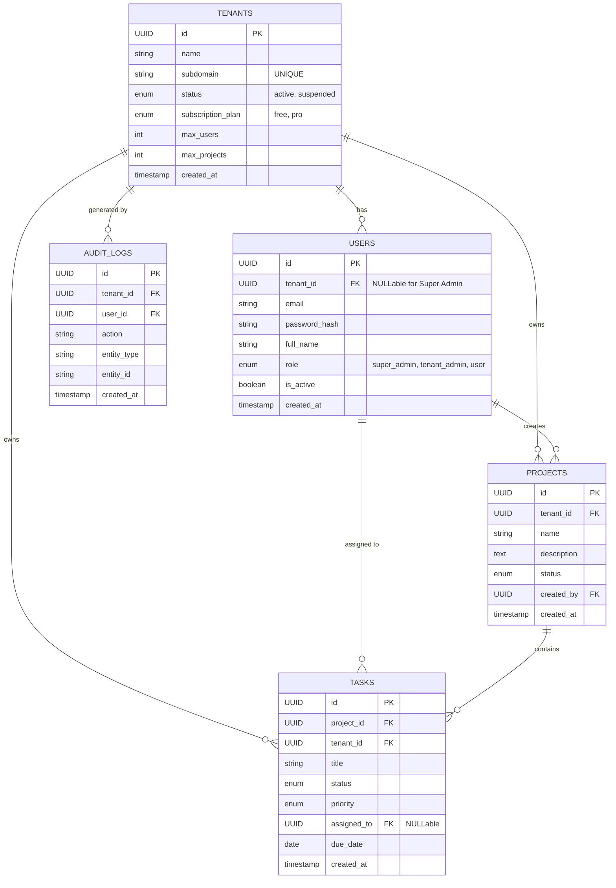

# System Architecture

## System Architecture Diagram

```mermaid
graph TD
    User((User))
    Browser[Frontend App (React)]
    Backend[Backend API (Node.js/Express)]
    DB[(PostgreSQL Database)]

    User -->|Interacts| Browser
    Browser -->|HTTP Request / JWT Auth| Backend
    Backend -->|SQL Query / Tenant Isolation| DB
    Backend -->|Log Audit Trail| DB
```

The system follows a typical three-tier architecture:
1.  **Frontend:** React Single Page Application (SPA).
2.  **Backend:** Node.js Express REST API.
3.  **Database:** PostgreSQL with shared schema multi-tenancy.

## Database Design (ERD)

The database uses a **Shared Schema with Tenant ID** approach. All tables (except `users` for super admin) have a `tenant_id` column for logical separation.



### Table Details
All tables enforce foreign key constraints (`ON DELETE CASCADE`) to maintain referential integrity. Indexes on `tenant_id` ensure performant queries.

## API Architecture

The API follows a modular structure separated by resource type.

### Authentication Module
*   `POST /api/auth/register-tenant`: Create new tenant & admin user.
*   `POST /api/auth/login`: Issue JWT token.
*   `GET /api/auth/me`: Validate token & get user details.
*   `POST /api/auth/logout`: Invalidate session (client-side).

### Tenant Management Module
*   `GET /api/tenants/:tenantId`: Get specific tenant details (Self/Admin only).
*   `PUT /api/tenants/:tenantId`: Update tenant settings.
*   `GET /api/tenants`: List all tenants (Super Admin only).

### User Management Module
*   `POST /api/tenants/:tenantId/users`: Add user to tenant.
*   `GET /api/tenants/:tenantId/users`: List users in tenant.
*   `PUT /api/users/:userId`: Update user profile/role.
*   `DELETE /api/users/:userId`: Remove user.

### Project Management Module
*   `POST /api/projects`: Create project.
*   `GET /api/projects`: List projects for current tenant.
*   `PUT /api/projects/:projectId`: Update project.
*   `DELETE /api/projects/:projectId`: Delete project.

### Task Management Module
*   `POST /api/projects/:projectId/tasks`: Create task.
*   `GET /api/projects/:projectId/tasks`: List tasks.
*   `PATCH /api/tasks/:taskId/status`: Quick status update.
*   `PUT /api/tasks/:taskId`: Full task update.
